# 项目目的

本项目计划基于Qwen3搭建一个法律知识信息问答系统。

# 技术路线

## Embedding Model

### 数据集

- 范围：包含中国生效的宪法、法律法规、行政法规、监察法规、司法解释、地方性法规共计9575篇
- 来源：[国家法律法规数据库](https://flk.npc.gov.cn/index.html)
- 预处理：暂时舍弃了目录部分和附录部分，删除了角注、页码和非法字符
- 数据选取：因为设备资源有限，本项目并不能处理总数据集中的每一条法律条文，只能处理其中一部分子集，为了使得该子集能够尽可能地代表原数据集。使用Qwen3-Embedding-0.6B模型将它们的条文部分内容转化为向量。在向量空间中使用贪心算法获得分布均匀、代表性强的子集。原始数据集大小为382779，未采样的数据集和采样后的数据集的Chamfer距离随采样数量的变化如下图所示。同时在考虑了GPU的推理时间之后，将采样的数量设置为10000。（调用阿里云百炼api生成10000个样本需要花费大约100元，使用QLoRA微调的时间大约是50个小时。这意味着每增加1000个样本，生成成本需要增加10元，训练时间需要增加5个小时。而采样数量越大，chamfer距离的减小速度也越慢。）
  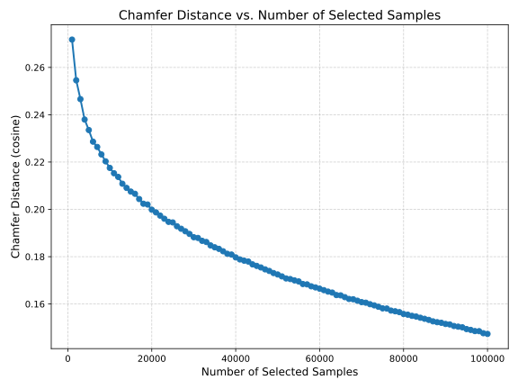
- 数据生成：随机选取chunk作为正例样本，基于qwen3-235b-a22b-instruct-2507模型使用self instruct方法自动化生成(query, postive_doc, negative_doc0,...,negative_dock)组合
- 数据清理：删除了其中正例文档为空的数据，以及对为空的负例文档使用其它文档作了替换，实际得到的数据集大小为9999。

### Tokenizer

为了配合Embedding的微调任务，tokenizer直接使用预训练模型对应的分词器

数据集中的query， postive_doc， negative_doc在现有的的tokenizer下对应的token长度分布情况如下图所示，在权衡了覆盖性和GPU能力之后，选择将Tokenizer输出的最大长度定为512。
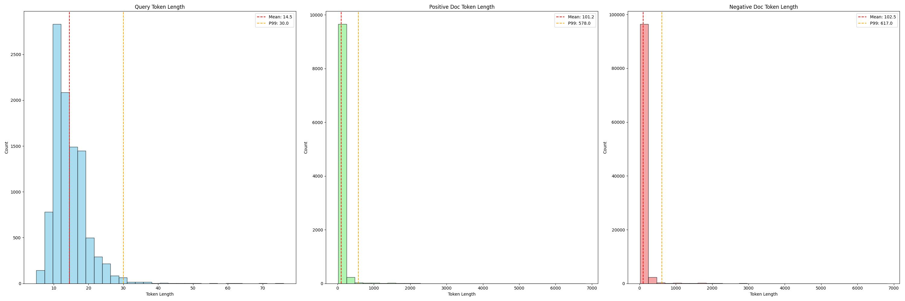

### Model

使用Qwen3-Embedding-0.6B架构，分别采取以下技术路线进行对比实验：

- Freeze微调：全参数微调模型中最后四层的layers和归一化层
- QLoRA微调：微调模型中的q_proj、k_proj、v_proj、o_proj参数矩阵

## Reranker Model
### 数据集
使用微调Embedding模型的数据集
### Tokenizer
同样使用了预训练模型自带的tokenizer。

如下图所示，同样分析了输入和输出对应的token长度，在考虑了覆盖性和GPU负载能力后，选择将max_token_length定为512。
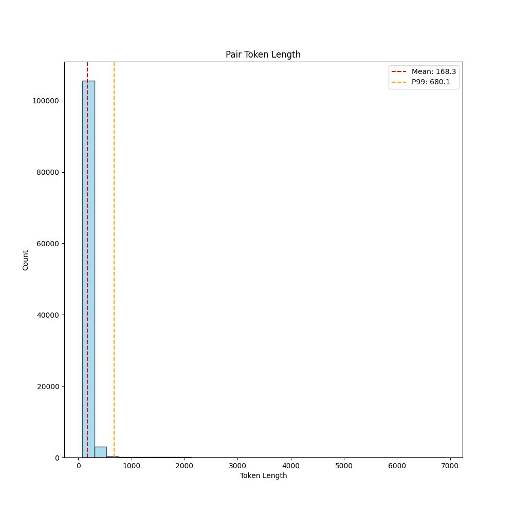
### Model

使用Qwen3-Reranker-0.6B架构，采取以下技术路线进行对比实验：

- QLoRA微调：微调模型中的q_proj、k_proj、v_proj、o_proj参数矩阵
## LLM-SFT
### 数据集
数据生成：使用微调Embedding Model的数据集中的(query, positive_doc)数据，基于qwen3-235b-a22b-instruct-2507模型使用self instruct方法自动化生成(query, doc, answer)三元组。（由于api对于敏感词的审核较为严格，实际得到的数据集大小为9991）
### Tokenizer
同样使用了预训练模型自带的tokenizer。

如下图所示，同样分析了输入对应的token长度，在考虑了覆盖性和GPU负载能力后，选择将max_token_length定为1024。
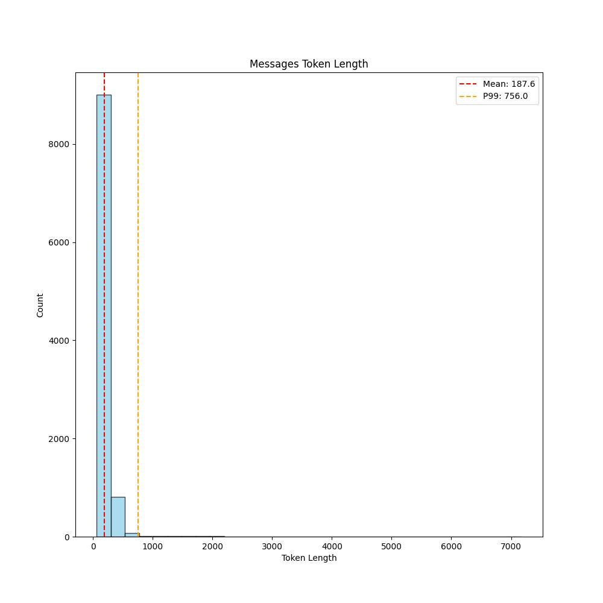
### Model

使用Qwen3-8B架构，采取以下技术路线进行对比实验：

- QLoRA微调：微调模型中的q_proj、k_proj、v_proj、o_proj参数矩阵
## Reward Model
### 数据集
数据生成：使用微调Embedding Model的数据集中的(doc)数据，基于qwen3-235b-a22b-instruct-2507模型使用self instruct方法自动化生成(query, doc, answer_good, answer_bad)四元组。（由于api对于敏感词的审核较为严格，实际得到的数据集大小为9991）在设计生成差回答时，设计了信息不完整、表述模糊、缺乏实用性、结构混乱、术语误用和口语化过度的情况。
### Tokenizer
同样使用了预训练模型自带的tokenizer。

如下图所示，同样分析了输入对应的token长度，在考虑了覆盖性和GPU负载能力后，选择将max_token_length定为1024。
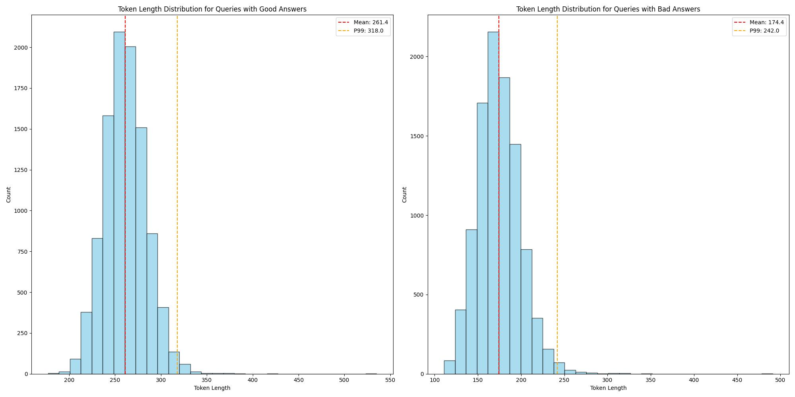
### Model
输入问答对之后，通过提示词方式让LLM判断这个回答是否是一个好回答，是的话就输出"yes"，不是的话就输出"no"，通过比较LLM对这两个Token的预测值，来评价该模型的得分$r$

使用Qwen3-0.6B架构，采取以下技术路线进行对比实验：

- QLoRA微调：微调模型中的q_proj、k_proj、v_proj、o_proj参数矩阵

损失函数设计如下：
$$\begin{align*}
&\because r=\frac{e^{l_{yes}}}{e^{l_{yes}}+e^{l_{no}}}=\frac{1}{1+e^{-(l_{yes}-l_{no})}}=sigmoid(l_{yes}-l_{no})\\
&\text{令} s=l_{yes}-l_{no}\\
&\therefore r=sigmoid(s)\\
&\text{将}r^+\text{和}r^-\text{代入交叉熵计算公式，可得}\\
&BCE^+=-E[1*\log(r^+)+0*\log(1-r^+)]=-E[log(r^+)]\\
&BCE^-=-E[0*\log(r^-)+1*\log(1-r^-)]=-E[log(1-r^-)]\\
&\therefore Loss = BCE^++BCE^-=-E[log(r^+)+log(1-r^-)]\\
&\text{将}r=sigmoid(s)\text{和}s=l_{yes}-l_{no}\text{代入，可得}\\
&Loss=-E[log(sigmoid(l^+_{yes}-l^+_{no}))+log(1-sigmoid(l^-_{yes}-l^-_{no}))]
\end{align*}$$

其中，$l_{yes}$和$l_{no}$分别为输入问题和回答之后，llm输出的yes和no在第一个token对应的词表中的值。

# 结果及分析

## Embedding Model
由于在微调前，模型的Recall@1已经达到了0.9995，所以不能直接比较Recall@1。使用分离度来衡量改进。
$$margin = sim(q,d^+)-max_i(sim(q,d_i^-))$$

|Model|GPU Memory Usage(MiB) while Training|Margin on Test Set|
|---|---|---|
|Base Model|-| 0.4380992329120636 |
|Freeze|19096| 0.6184983235597611 | 
|QLoRA|4686| 0.7048807286024094 | 

Freeze微调训练过程中的Loss曲线：
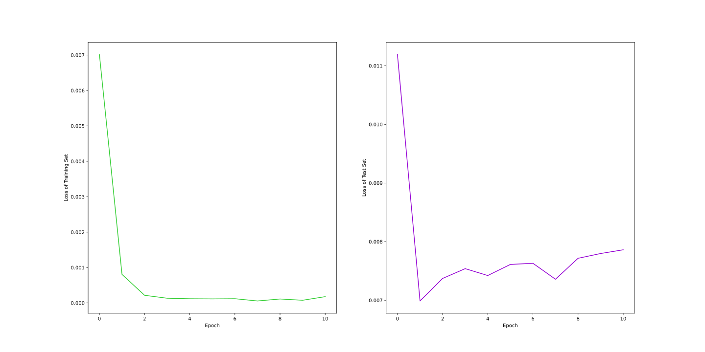
QLoRA微调训练过程中的Loss曲线：
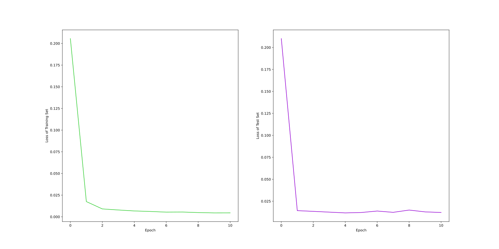

## Reranker Model
在微调前，模型的平均得分已经达到了0.9946536738872528，且训练过程中loss只是下降幅度不明显，所以认为该模型并不需要微调。

$$\text{平均得分}=\frac{p(yes|(q,d^+))+\sum_{i=1}^Np(no|(q,d_i^-))}{1+N}$$

## LLM-SFT
使用测试集部分的query作为输入，将SFT微调前后的模型输出与数据集中的answer作对比，使用BERTScore量化指标。
|Model| Precision | Recall | F1 |
|---|---|---|---|
|Base|0.757|0.594|0.664|
|RAG|0.896| 0.833 | 0.861 |
|RAG + SFT| 0.932 | 0.945 | 0.937 |

基础模型输出与数据集answer的BERTScore分布：

基础模型搭配RAG输出与数据集answer的BERTScore分布：
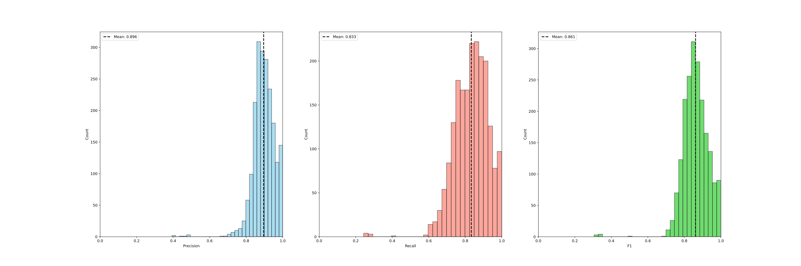
微调模型搭配RAG输出与数据集answer的BERTScore分布：
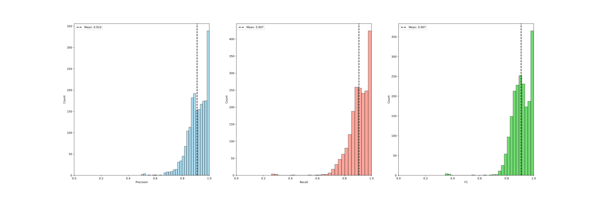

## Reward Model
在测试集上分别使用HPC（人类偏好一致性）、MD（均值差）和Disp（合并标准差）来评估奖励模型。
$$HPC=E[𝟙_{R^+}(r^+-r^-)],MD=E[r^+-r^-],Disp=\sqrt{\frac{\sigma (r^+)^2+\sigma (r^-)^2}{2}}$$

|Model| HPC | MD | Disp |
|---|---|---|---|
|Base|0.8855|0.13909377606213102|0.09623180495273174|
|QLoRA|1.0| 0.9968128237673659| 0.02908888012174566|

微调训练过程中的Loss曲线：
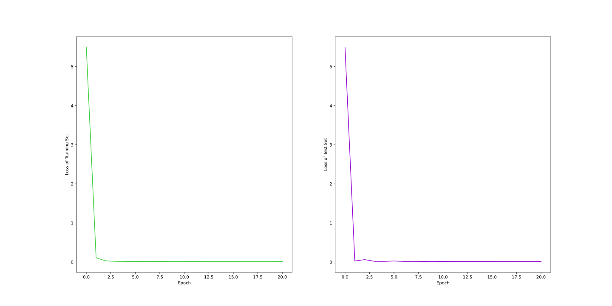
# 过程中的思考：

## 总方向

- 为什么使用RAG？
  - 因为法律规定过几年会改变，如果使用RAG的形式，可以直接修改知识库。而如果只微调模型让其记住这些法律知识，那么就需要将整个模型重新微调才能记住新的法律，并且可能会遗留下旧版本的法律的记忆。
- 为什么做了RAG还要做微调呢？
  - 因为没有经过微调的大模型只是在普遍场景下比较好，特定在法律知识问答任务下的能力并不是很好。

## RAG

- 为什么使用Byte Level的BPE分词？
  - 因为这样分词能够解决 OOV（Out-Of-Vocabulary）问题，支持所有语言的输入。
- 如下图所示，Tokenizer的训练中，vocab_size越大，平均chunk对应的token数量就越少，能够加速模型的推理速度，是不是vocab_size越大越好呢？
  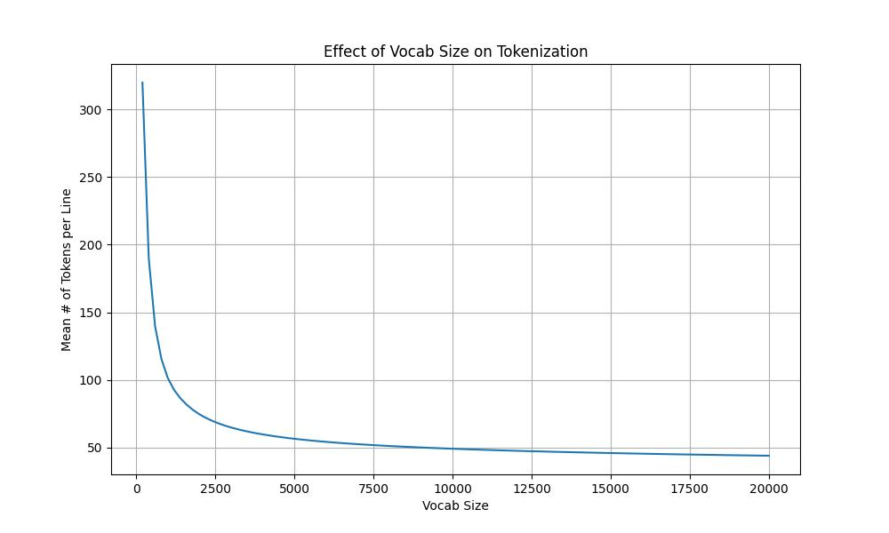
  - 不是的，因为vocab_size越大，需要存储的embedding矩阵就越大。
  - 同时，如果词表中包含有一些极少见的词，也会使得模型缺少泛化性，过拟合。
  - 如果 vocab_size 非常大，会引起 softmax 层计算复杂度增加（因为softmax 需遍历所有词表），这也会导致推理变慢。
- 为什么选择父子分段的切块方式？
  - 因为该项目面向的时法律法规文件，带有很强的结构性（编、章、节、条）。所以切chunk时使用父子分段的方式设计多层结构。而常规的根据换行符或者特定符号分段的方式更适合其它资料
- 在RAG中，为什么先是Retriever，后是Reranker？
  - 因为我们的第一步其实是从海量数据中筛选出一小批待选数据，如果使用Reranker那样的一一比对的方法，执行速度太慢了。而使用Retriver时，我们可以使用倒排索引等近似最近邻算法找到近似的搜索结果。
  - 而经过Retriever之后，得到的结果是粗糙的。但是这时候我们地目标数据集是比较小的了，我们就可以使用Reranker精细地再筛选一次。
- 在RAG中，为什么Retriever使用的是对比学习，而Reranker使用的是句对回归（不是句对分类）？
  - 在Retriever中，我们想要的结果是：输入chunk，得到编码好的向量，所以常用对比学习。
  - 而在Reranker中，我们希望得到的结果是：输入两个chunk，得到这两个chunk之间的相似度。同时，因为我们想要能够让用户控制这个相似度的阈值，所以不能是句对分类，只能是句对回归。
- 在Embedding中，为什么使用的Transformer通常是双向注意力机制，而在训练LLM时，使用的是单向注意力机制？
  - 在Embedding中，每个token需要看到同一chunk中其它token，这样才能结合句子中整体语义获得当前token的表达向量
  - 在LLM中，我们的预计工作是根据现在已有的token预测下一个token，那么在训练时，就不应该让其能够看到之后的token。
- 为什么SFT微调之后还需要RL微调？
  - SFT的目的是让模型学会基本语言格式和遵循指令，它在训练数据集分布内能够有一个合格的回答。但是它存在一些问题：SFT只会让模型模仿训练集中的答案，如果数据集中的数据量有限，很容易出现过拟合现象，同时，模型也不能主动探索更多的回答空间。
  - 而RL基于人类偏好给予模型反馈，让模型的输出更符合人类偏好（简洁/详细、礼貌/直率、安全/开放，取决于奖励信号）。
- 为什么不可以直接使用SFT数据集中的query和answer作为RLHF数据集中的query和answer_good？
  - SFT 中的question“太简单（只有唯一正确答案）”，不适合复用，无法区分 “回答质量差异”
  - SFT中的answer虽然正确，但是并没有在“人类主观体验”上优化

# 知识笔记

- ``倒排索引``：倒排文件索引，也称为倒排索引，是一种数据结构，通过将数据组织成簇并在这些簇中存储对向量的引用来加速向量数据库中的相似性搜索 通过将搜索重点放在数据的较小子集上，可以有效地检索相似的向量，从而显著减少计算开销。以下是其工作原理的详细说明：
  - 聚类：
    - 使用 K 均值聚类等技术将向量数据集划分为聚类。
    - 每个聚类都与一个质心相关联，质心代表聚类的“中心”。
    - 数据集中的每个向量都根据距离分配到其最近的聚类。
  - 倒排文件创建：
    - 创建一个倒排文件索引，将每个聚类（质心）映射到属于该聚类的向量列表。
    - 该列表充当索引，允许快速访问特定集群内的向量。
  - 搜索过程：
    - 当引入查询向量时，计算其到每个聚类质心的距离。
    - 确定最近的质心（及其对应的聚类）。
    - 将相似向量的搜索范围缩小到该簇内的向量，而不是整个数据集。

# 项目日志

## 20250709

- 今天发现，如果只使用民法典作分词处理，即使将tokenizer的vocab_size设置为151669，实际上训练出来的tokenizer的vocab_size也只有9139。这说明民法典中的语料也不足够。引入刑法之后，训练的tokenizer的vocab_size也只有12906。再引入了劳动法，vocab_size是13351。说明，需要足够多的文件才能够训练出vocab_size满足要求的tokenizer
- 之前处理法律文件时，对每一个法律都要单独处理，这样费时费力，并且每次都需要对每个法律文件进行调整。为了解决这个问题，统一从[国家法律法规数据库](https://flk.npc.gov.cn/index.html)中下载数据，保证格式的一致性。
- 在下载文件时，发现文件内容特别多，所以使用爬虫爬取，节约人力成本

## 20250711

- 在使用github desktop时，发现自己对于git命令生疏了，也就意味着目前缺乏项目工程管理能力，需要重新学习这方面知识
- 原本计划将中国所有法律法规都引入，但是发现如果全部引入，那么微调和训练embedding的问答数据库所需时间需要一年，不符合实际，所以必须减少数据库的数量

## 20250716

- 决定使用降采样的方式减少数据库数量，初步计划按照顺序每50个条文采样一个条文，但是这样忽略了文本中语义的重要性。为了解决这个问题，使用Qwen3-Embedding-0.6B将法律条文信息转为向量信息，再在向量空间中选出覆盖性最强、彼此差异最大的子集。

## 20250718

- 发现之前用的向量距离是欧式距离，但是该任务中需要的是余弦距离。这是粗心犯的错
- 在降维法律的embedding向量时使用的是PCA，导致可视化分析不可靠。
- 在设计贪心算法时，原来使用的是Numpy，生成一次结果需要两小时半，速度太慢了，改用pytorch并使用cuda加速，同时优化了算法强化了计算的并行性，现在计算一次时间只需要2分钟。
- 在使用self instruct生成训练retriever的embedding model的数据集时，发现提示词的设计密切关系到生成的query的质量。这说明提示词的设计很有必要性。

## 20250721

- 在重训练Embedding模型时，发现按照原始qwen3-embedding-0.6b的设置去训练会爆内存。经过分析发现，这是因为Embedding模型设置的max_length太大了。同时，经过类比分析，认为没有必要将Retriever的tokenizer的vocab_size设定为与原文一致。这说明每个参数的大小设定都必须有根据，不能盲目或者跟风设置。
- 在查看筛选出来的数据集时，发现有些正例文档和负例文档不完整，经过研究发现，是在做正则处理时过滤页码时将一些行也过滤了。同时还发现之前在过滤文本中的不合法符号时，将一些合法符号如逗号、括号等也过滤了。

## 20250722

- 在检查筛选数据时，发现仍然有部分数据不完整的情况。发现是源文件本身存在问题，排除代码层面上的错误。

## 20250724

- 之前使用ollama部署的qwen3:32b模型去生成retriever训练数据集，但是这样的速度很慢，并且生成的问答对质量不高，为了解决这个问题，改用阿里云百炼的api调用模型完成。

## 20250725

- 在使用RetrieverDataset_selfinstruct时，发现里面有些元素值是nan，将positive_doc为nan的行删除，从所有positive_doc中采样替换为nan的negative_doc。由于使用了贪心算法进行采样，positive_doc之间具有较强的不相关性，所以可以被用来替换掉为nan的negative_doc。

## 20250805

- 之前重训练的Tokenizer只在法律文档和query上训练，这会导致当用户问一些和法律无关的问题时，模型无法处理，所以仍旧使用预训练好的分词器。同时，从实验中舍弃重新训练Embedding模型的技术路线。

## 20250808

- 之前使用recall@1去评估微调后的Embedding模型在测试集上的性能，但是发现即使没有微调的模型在测试集上的Recall@1也是0.9995，之后即使微调了，也没有变化。所以更改为使用和Training的Loss一样的指标评估。

## 20250821

- SFT微调LLM时，没有考虑chat template，导致之前的训练无效。

## 20250823

- SFT微调的指令格式和self instruct不一致，导致需要重新生成数据集

## 20250907

- 今天在设计微调奖励模型的损失函数，初始时计划将损失函数设计成$-E[\log(sigmoid (r^+-r^-))]$，但是我们的$r^+-r_-$的取值范围是$[-1,1]$，经过$sigmoid$函数之后会进一步压缩范围，所以改成$-E[\log(sigmoid(s^+-s^-))]$。但是这样会带来一个新的问题，那就是$s^+$可能和$s^-$同时下降，但是$s^-$下降的幅度更大，此时损失函数也会下降，所以我们不能只关注两者的差值，而应该分别独立观察它们的值。在实验过后，还发现了一个问题，我们的损失函数设计是针对的$s^+$和$s^-$之间的差值，将其转换为$r^+$和$r^-$之后，虽然模型在HPC和MD两个指标都有提升，但是Disp指标上下降明显。此时将损失函数设置为这时想到了交叉熵函数$-(y^*log(y)+(1-y^*)log(1-y))$。分别将$r^+$和$r^-$的计算方式代入可得$-(\log (sigmoid(s^+))+\log (1-sigmoid(s^-)))$，也就是$-\log (sigmoid(s^+)(1-sigmoid(s^-)))$。

# 参考文献
 ```bibtex
@article{qwen3embedding,
    title={Qwen3 Embedding: Advancing Text Embedding and Reranking Through Foundation Models},
    author={Zhang, Yanzhao and Li, Mingxin and Long, Dingkun and Zhang, Xin and Lin, Huan and Yang, Baosong and Xie, Pengjun and Yang, An and Liu, Dayiheng and Lin, Junyang and Huang, Fei and Zhou, Jingren},
    journal={arXiv preprint arXiv:2506.05176},
    year={2025}
}
```
```bibtex
@article{qwen3,
    title={Qwen3 Technical Report}, 
    author={An Yang and Anfeng Li and Baosong Yang and Beichen Zhang and Binyuan Hui and Bo Zheng and Bowen Yu and Chang Gao and Chengen Huang and Chenxu Lv and Chujie Zheng and Dayiheng Liu and Fan Zhou and Fei Huang and Feng Hu and Hao Ge and Haoran Wei and Huan Lin and Jialong Tang and Jian Yang and Jianhong Tu and Jianwei Zhang and Jianxin Yang and Jiaxi Yang and Jing Zhou and Jingren Zhou and Junyang Lin and Kai Dang and Keqin Bao and Kexin Yang and Le Yu and Lianghao Deng and Mei Li and Mingfeng Xue and Mingze Li and Pei Zhang and Peng Wang and Qin Zhu and Rui Men and Ruize Gao and Shixuan Liu and Shuang Luo and Tianhao Li and Tianyi Tang and Wenbiao Yin and Xingzhang Ren and Xinyu Wang and Xinyu Zhang and Xuancheng Ren and Yang Fan and Yang Su and Yichang Zhang and Yinger Zhang and Yu Wan and Yuqiong Liu and Zekun Wang and Zeyu Cui and Zhenru Zhang and Zhipeng Zhou and Zihan Qiu},
    journal = {arXiv preprint arXiv:2505.09388},
    year={2025}
}
```