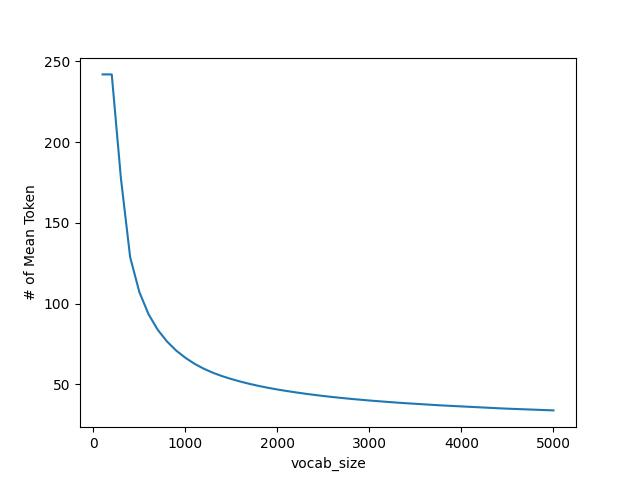

# 前言
本项目计划基于Qwen3搭建一个法律知识信息问答系统。
# 设计时的思考：
## 总方向
- 为什么使用RAG不适用微调？
    - 因为法律规定过几年会改变，如果使用RAG的形式，可以直接修改知识库。而如果只微调模型，那么就需要将整个模型重新微调才能记住新的法律，并且可能会遗留下旧版本的法律的记忆。
- 为什么做了RAG还要做微调呢？
    - 因为没有经过微调的大模型只是在普遍场景下比较好，特定在法律知识问答任务下的能力并不是很好。
## RAG

- 如上图所示，Tokenizer的训练中，vocab_size越大，平均chunk对应的token数量就越少，是不是vocab_size越大越好呢？
    - 不是的，因为vocab_size越大，需要存储的embedding矩阵就越大。同时，如果词表中包含有一些极少见的词，也会使得模型缺少泛化性，过拟合。
- 为什么选择父子分段的切块方式？
    - 因为该项目面向的时法律法规文件，带有很强的结构性（编、章、节、条）。所以切chunk时使用父子分段的方式设计多层结构。而常规的根据换行符或者特定符号分段的方式更适合一些无结构或者
# 技术路线
- 数据来源：中华人民共和国民法典2020年版
- 数据处理：暂时舍弃了目录部分和附录部分，删除了角注和页码
- RNG 部分Tonkizer: