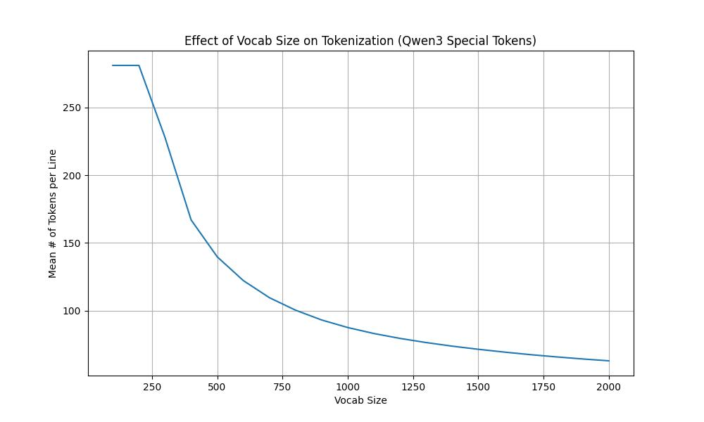

# 项目目的
本项目计划基于Qwen3搭建一个法律知识信息问答系统。
# 技术路线
- 总数据集：
    - 范围：生效的宪法、法律法规、行政法规、监察法规、司法解释、地方性法规
    - 来源：[国家法律法规数据库](https://flk.npc.gov.cn/index.html)
    - 预处理：暂时舍弃了目录部分和附录部分，删除了角注、页码和非法字符
- Retriever训练数据集：
    - 随机选取chunk作为正例样本，通过ollama部署的Qwen3:32b模型并使用self instruct方法自动化生成(query, postive docs, negative docs)三元组
    - 使用MoDS方法再次筛选，从上一步骤的结果中筛选出高质量的训练数据
    - 数据集评估:
- RNG：
    - Tokenizer：
        - 重新训练：使用BPE切词。为了对齐Qwen3-Embedding-0.6B架构使用的Embedding Lookup，将vocab_size设置为了151669。但是重新训练的Tokenizer只能给重新训练的Embedding模型和Rerank模型用
        - 直接使用：使用已有的Qwen/Qwen3-Embedding-0.6B对应的Tokenizer
    - Retriever：
        - 重新训练：使用Qwen3-Embedding-0.6B架构，但不使用其权重和Embedding矩阵。
        - 微调： 使用Qwen/Qwen3-Embedding-0.6B的架构和权重，使用LoRA和QLoRA分别微调
    - 
# 结果及分析
## RNG Tokenizer
使用已分好块的语料库做测试，计算每一个chunk对应的Token数量的平均数。
|     | Pretrained Tokenizer   | Retrained Tokenizer |
|:---:|:---:|:---:|
|  # of Mean Token  | 54.17386496216359 | 22.577796558983728 |

可以看出，重新训练的Tokenizer所需的平均Token数量更少，这是因为它是根据该任务特定的语料库作训练的，在优化上做得更好。
# 过程中的思考：
## 总方向
- 为什么使用RAG？
    - 因为法律规定过几年会改变，如果使用RAG的形式，可以直接修改知识库。而如果只微调模型让其记住这些法律知识，那么就需要将整个模型重新微调才能记住新的法律，并且可能会遗留下旧版本的法律的记忆。
- 为什么做了RAG还要做微调呢？
    - 因为没有经过微调的大模型只是在普遍场景下比较好，特定在法律知识问答任务下的能力并不是很好。
## RAG
- 为什么使用Byte Level的BPE分词？
    -  因为这样分词能够解决 OOV（Out-Of-Vocabulary）问题，支持所有语言的输入。

- 如上图所示，Tokenizer的训练中，vocab_size越大，平均chunk对应的token数量就越少，能够加速模型的推理速度，是不是vocab_size越大越好呢？
    - 不是的，因为vocab_size越大，需要存储的embedding矩阵就越大。
    - 同时，如果词表中包含有一些极少见的词，也会使得模型缺少泛化性，过拟合。
    - 如果 vocab_size 非常大，会引起 softmax 层计算复杂度增加（因为softmax 需遍历所有词表），这也会导致推理变慢。
- 为什么选择父子分段的切块方式？
    - 因为该项目面向的时法律法规文件，带有很强的结构性（编、章、节、条）。所以切chunk时使用父子分段的方式设计多层结构。而常规的根据换行符或者特定符号分段的方式更适合其它资料
- 在RAG中，为什么先是Retriever，后是Reranker？
    - 因为我们的第一步其实是从海量数据中筛选出一小批待选数据，如果使用Reranker那样的一一比对的方法，执行速度太慢了。而使用Retriver时，我们可以使用倒排索引等近似最近邻算法找到近似的搜索结果。
    - 而经过Retriever之后，得到的结果是粗糙的。但是这时候我们地目标数据集是比较小的了，我们就可以使用Reranker精细地再筛选一次。
- 在RAG中，为什么Retriever使用的是对比学习，而Reranker使用的是句对回归（不是句对分类）？
    - 在Retriever中，我们想要的结果是：输入chunk，得到编码好的向量，所以常用对比学习。
    - 而在Reranker中，我们希望得到的结果是：输入两个chunk，得到这两个chunk之间的相似度。同时，因为我们想要能够让用户控制这个相似度的阈值，所以不能是句对分类，只能是句对回归。
- 在RAG中，为什么使用的Transformer是双向注意力机制，而在训练LLM时，使用的是单向注意力机制？
    - 在RAG中，每个token需要看到同一chunk中其它token，这样才能结合句子中整体语义获得当前token的表达向量
    - 在LLM中，我们的预计工作是根据现在已有的token预测下一个token，那么在训练时，就不应该让其能够看到之后的token。
# 知识笔记
- ```倒排索引```：倒排文件索引，也称为倒排索引，是一种数据结构，通过将数据组织成簇并在这些簇中存储对向量的引用来加速向量数据库中的相似性搜索 通过将搜索重点放在数据的较小子集上，可以有效地检索相似的向量，从而显著减少计算开销。以下是其工作原理的详细说明：
    - 聚类：
        - 使用 K 均值聚类等技术将向量数据集划分为聚类。
        - 每个聚类都与一个质心相关联，质心代表聚类的“中心”。
        - 数据集中的每个向量都根据距离分配到其最近的聚类。
    - 倒排文件创建： 
        - 创建一个倒排文件索引，将每个聚类（质心）映射到属于该聚类的向量列表。
        - 该列表充当索引，允许快速访问特定集群内的向量。 
    - 搜索过程： 
        - 当引入查询向量时，计算其到每个聚类质心的距离。
        - 确定最近的质心（及其对应的聚类）。
        - 将相似向量的搜索范围缩小到该簇内的向量，而不是整个数据集。
# 项目日志
## 20250709
- 今天发现，如果只使用民法典作分词处理，即使将tokenizer的vocab_size设置为151669，实际上训练出来的tokenizer的vocab_size也只有9139。这说明民法典中的语料也不足够。引入刑法之后，训练的tokenizer的vocab_size也只有12906。再引入了劳动法，vocab_size是13351。说明，需要足够多的文件才能够训练出vocab_size满足要求的tokenizer
- 之前处理法律文件时，对每一个法律都要单独处理，这样费时费力，并且每次都需要对每个法律文件进行调整。为了解决这个问题，统一从[国家法律法规数据库](https://flk.npc.gov.cn/index.html)中下载数据，保证格式的一致性。
- 在下载文件时，发现文件内容特别多，所以使用爬虫爬取，节约人力成本
## 20250711
- 在使用github desktop时，发现自己对于git命令生疏了，也就意味着目前缺乏项目工程管理能力，需要重新学习这方面知识